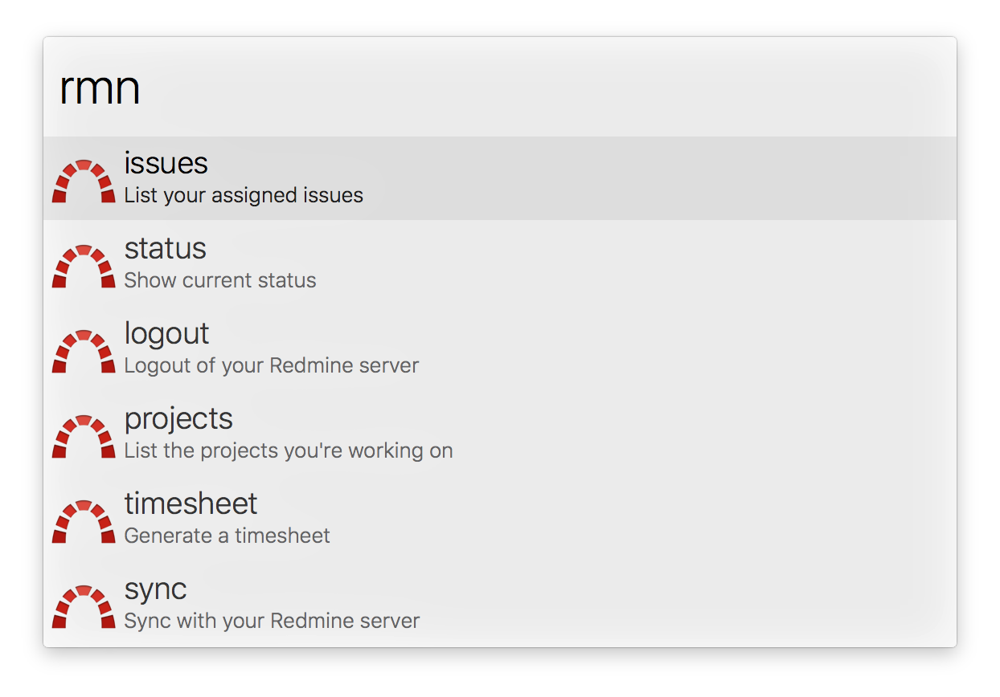

# alfred-redmine

An Alfred workflow for accessing a Redmine server

## Installation

Download the [latest release](https://github.com/jason0x43/alfred-redmine/releases) of the workflow package and double click it -- Alfred will take care of the rest.

## Usage

The workflow provides several commands. The base command, and the one you'll want to run first, is `rmn`. This command lists the available subcommands. The first time the keyword is used, only a single item will be available: “login”. Actioning this item will prompt you for your username and password. These are used to authenticate with your Redmine server to retrieve your API token; they aren’t stored afterwords.

Once you’ve logged in, a number of commands will be available. These may be accessed using the `rmn` keyword, and usually with a dedicated keyword as well (e.g., `rmn issues` == `rmi`).

### issues

The "issues" subcommand (`rmi` keyword) will list the issues that you're assigned to or watching. Actioning an issue will show details about the issue (currently just status and subject). Holding Cmd while actioning an issue will open its page on Redmine in a browser. Actioning the "View all" heading will open a list of all your issues on Redmine in a browser.

When the issue details list is open, actioning the status will bring up a list of available statuses; selecting one of these will update the issue status on Redmine.

### projects

The "projects" subcommand (`rmp` keyword) will list the projects that have issues related to you. Actioning a project item will show those issues. Actioning the project name item at the top of the issue list will return you to the list of projects.

### status

The "status" subcommand (`rms` keyword) shows current status. This includes whether a workflow update is available and a list of the issues currently assigned to you.

### sync

The "sync" subcommand updates all cached data (projects, issues, time entries, etc.) from Redmine.

### timesheet

The "timesheet" subcommand (`rmt` keyword) shows spent time for dates or date ranges. There are three pre-defined date ranges: "today", "yesterday", and "week". You may also enter a custom date using various formats (mm/dd, mm/dd/yy, yyyy-mm-dd), as well as a date range (two dates separated by "..").
